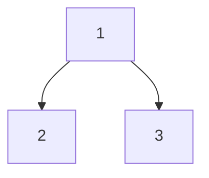

# CSA0308 - Data Structures

### QN-1 (Matrix_Multiplication):
```c
#include <stdio.h>

int main() 
{
  int m, n, p, q, i, j, k;
  printf("Enter the number of rows and columns of the first matrix: ");
  scanf("%d %d", &m, &n);
  printf("Enter the number of rows and columns of the second matrix: ");
  scanf("%d %d", &p, &q);

  if (n != p) 
  {
    printf("Matrices cannot be multiplied.\n");
    return 0;
  }

  int first[m][n], second[p][q], result[m][q];

  printf("Enter elements of first matrix:\n");
  for (i = 0; i < m; i++) 
  {
    for (j = 0; j < n; j++) 
    {
      scanf("%d", &first[i][j]);
    }
  }

  printf("Enter elements of second matrix:\n");
  for (i = 0; i < p; i++) 
  {
    for (j = 0; j < q; j++) 
    {
      scanf("%d", &second[i][j]);
    }
  }

  for (i = 0; i < m; i++) {
    for (j = 0; j < q; j++) {
      result[i][j] = 0;
      for (k = 0; k < n; k++) {
        result[i][j] += first[i][k] * second[k][j];
      }
    }
  }

  printf("Product of the matrices:\n");
  for (i = 0; i < m; i++) {
    for (j = 0; j < q; j++) {
      printf("%d ", result[i][j]);
    }
    printf("\n");
  }

  return 0;
}
```
OUTPUT:


---
### QN-2 (Odd_or_Even):
```c
#include <stdio.h>

int main() 
{
  int n, i, num;
  printf("Enter the number of elements: ");
  scanf("%d", &n);
  printf("Enter the elements: \n");
  for (i = 0; i < n; i++) 
  {
    scanf("%d", &num);
    if (num % 2 == 0) 
    {
      printf("%d is even\n", num);
    } 
    else 
    {
      printf("%d is odd\n", num);
    }
  }
  return 0;
}
```
OUTPUT:


---

### QN-3 (Factorial_without_Recursion):
```c
#include <stdio.h>

int main() 
{
  int num, i;
  long int fact = 1;
  printf("Enter a number: ");
  scanf("%d", &num);
  for (i = 1; i <= num; i++) 
  {
    fact = fact * i;
  }
  printf("Factorial of %d is: %ld", num, fact);
  return 0;
}
```
OUTPUT:


---

### QN-4 (Fibo_without_Recursion):
```c
#include <stdio.h>

int main() 
{
  int n, a = 0, b = 1, c;
  printf("Enter the number of terms: ");
  scanf("%d", &n);
  printf("Fibonacci Series: ");
  for (int i = 1; i <= n; i++) 
  {
    printf("%d, ", a);
    c = a + b;
    a = b;
    b = c;
  }
  return 0;
}
```
OUTPUT:


---

### QN-5 (Factorial_with_Recursion):
```c
 #include <stdio.h>

long int factorial(int n) 
{
  if (n == 0) 
  {
    return 1;
  } 
  else 
  {
    return n * factorial(n - 1);
  }
}

int main() 
{
  int n;
  printf("Enter a positive integer: ");
  scanf("%d", &n);
  printf("Factorial of %d = %ld", n, factorial(n));
  return 0;
}
```
OUTPUT:


---

### QN-6 (Fibo_with_Recursion):
```c
#include<stdio.h>

int fibo(int a, int b,int c)
{
  if(c == 0)
  {
    return 0;
  }
  else
  {
    int t = a+b;
    printf(", %d ",t);
    fibo(b,t,c=c-1);
  }
}

void main()
{
  int in;
  printf("Enter the range: ");
  scanf("%d",&in);
  printf("0 , 1 ");
  fibo(0,1,in-2);
}
```
OUTPUT:


---

### QN-7 (Array_Operations):
```c
#include <stdio.h>

int main() 
{
  int arr[100], n, i, pos, choice;

  printf("Enter the number of elements in the array: ");
  scanf("%d", &n);

  printf("Enter the elements of the array:\n");
  for (i = 0; i < n; i++) 
  {
    scanf("%d", &arr[i]);
  }

  while (1) 
  {
    printf("\nArray Operations:\n");
    printf("1. Insert an element\n");
    printf("2. Delete an element\n");
    printf("3. Display the array\n");
    printf("4. Exit\n");
    printf("Enter your choice: ");
    scanf("%d", &choice);

    switch (choice) 
    {
      case 1:
        printf("\nEnter the position where you want to insert the element: ");
        scanf("%d", &pos);

        if (pos < 0 || pos > n) 
        {
          printf("Invalid position!\n");
        } 
        else 
        {
          for (i = n - 1; i >= pos; i--) 
          {
            arr[i + 1] = arr[i];
          }

          printf("Enter the element to be inserted: ");
          scanf("%d", &arr[pos]);
          n++;
        }

        break;

      case 2:
        printf("\nEnter the position of the element to be deleted: ");
        scanf("%d", &pos);

        if (pos < 0 || pos >= n) 
        {
          printf("Invalid position!\n");
        } 
        else 
        {
          for (i = pos; i < n - 1; i++) 
          {
            arr[i] = arr[i + 1];
          }

          n--;
        }

        break;

      case 3:
        printf("\nThe elements of the array are:\n");

        for (i = 0; i < n; i++) 
        {
          printf("%d ", arr[i]);
        }

        printf("\n");

        break;

      case 4:
        return 0;

      default:
        printf("\nInvalid choice!\n");
    }
  }
}
```
OUTPUT:


---

### QN-8 (Linear_Search):
```c
#include <stdio.h>

int main() 
{
  int arr[100], n, i, search;

  printf("Enter the number of elements in the array: ");
  scanf("%d", &n);

  printf("Enter the elements of the array:\n");
  for (i = 0; i < n; i++) 
  {
    scanf("%d", &arr[i]);
  }

  printf("Enter the element to be searched: ");
  scanf("%d", &search);

  for (i = 0; i < n; i++) 
  {
    if (arr[i] == search) 
    {
      printf("%d is present at location %d.\n", search, i + 1);
      break;
    }
  }

  if (i == n) 
  {
    printf("%d is not present in the array.\n", search);
  }

  return 0;
}
```
OUTPUT:


---

### QN-9 (Binary_Search):
```c
#include <stdio.h>

int main() 
{
  int arr[100], n, i, search, first, last, middle;

  printf("Enter the number of elements in the array: ");
  scanf("%d", &n);

  printf("Enter the elements of the array in ascending order:\n");
  for (i = 0; i < n; i++) 
  {
    scanf("%d", &arr[i]);
  }

  printf("Enter the element to be searched: ");
  scanf("%d", &search);

  first = 0;
  last = n - 1;
  middle = (first + last) / 2;

  while (first <= last) 
  {
    if (arr[middle] < search) 
    {
      first = middle + 1;
    } 
    else if (arr[middle] == search) 
    {
      printf("%d is present at location %d.\n", search, middle + 1);
      break;
    } 
    else 
    {
      last = middle - 1;
    }

    middle = (first + last) / 2;
  }

  if (first > last) 
  {
    printf("%d is not present in the array.\n", search);
  }

  return 0;
}
```
OUTPUT:


---
### QN-10 (Linked_List):
```c
#include <stdio.h>
#include <stdlib.h>

struct node 
{
  int data;
  struct node *next;
};

struct node *head = NULL;

// Insertion at the beginning of the list
void insertAtBeginning(int data) 
{
  struct node *newNode = (struct node*) malloc(sizeof(struct node));
  newNode->data = data;
  newNode->next = head;
  head = newNode;
}

// Insertion at the end of the list
void insertAtEnd(int data) 
{
  struct node *newNode = (struct node*) malloc(sizeof(struct node));
  newNode->data = data;
  newNode->next = NULL;

  if (head == NULL) 
  {
    head = newNode;
    return;
  }

  struct node *current = head;
  while (current->next != NULL) 
  {
    current = current->next;
  }

  current->next = newNode;
}

// Insertion after a given node
void insertAfterNode(struct node *prevNode, int data) 
{
  if (prevNode == NULL) 
  {
    printf("Previous node cannot be NULL.\n");
    return;
  }

  struct node *newNode = (struct node*) malloc(sizeof(struct node));
  newNode->data = data;
  newNode->next = prevNode->next;
  prevNode->next = newNode;
}

// Deletion at the beginning of the list
void deleteAtBeginning() 
{
  if (head == NULL) {
    printf("List is already empty.\n");
    return;
  }

  struct node *temp = head;
  head = head->next;
  free(temp);
}

// Deletion at the end of the list
void deleteAtEnd() 
{
  if (head == NULL) {
    printf("List is already empty.\n");
    return;
  }

  if (head->next == NULL) 
  {
    free(head);
    head = NULL;
    return;
  }

  struct node *current = head;
  while (current->next->next != NULL) 
  {
    current = current->next;
  }

  free(current->next);
  current->next = NULL;
}

// Deletion of a given node
void deleteNode(struct node *prevNode) 
{
  if (prevNode == NULL || prevNode->next == NULL) 
  {
    printf("Previous node cannot be NULL or last node.\n");
    return;
  }

  struct node *temp = prevNode->next;
  prevNode->next = temp->next;
  free(temp);
}

// Displaying the list
void displayList() 
{
  if (head == NULL) 
  {
    printf("List is empty.\n");
    return;
  }

  struct node *current = head;

  printf("List: ");
  
   while(current != NULL)
   {
      printf("%d ", current -> data);
      current=current -> next; 
   }
   printf("\n");
}

int main() {

   insertAtBeginning(5);
   insertAtBeginning(10);
   insertAtEnd(15);
   insertAfterNode(head,20);
   displayList();
   deleteAtBeginning();
   deleteAtEnd();
   deleteNode(head);
   displayList();

   return 0;

}
```
OUTPUT:


---

### QN-11 (Stack_Operations):
```c
#include <stdio.h>
#include <stdlib.h>

#define MAXSIZE 100

int stack[MAXSIZE];
int top = -1;

void push(int data) 
{
  if (top >= MAXSIZE - 1) 
  {
    printf("Stack overflow.\n");
    return;
  }

  stack[++top] = data;
}

int pop() 
{
  if (top < 0) 
  {
    printf("Stack underflow.\n");
    return -1;
  }

  return stack[top--];
}

int peek() {
  if (top < 0) 
  {
    printf("Stack is empty.\n");
    return -1;
  }

  return stack[top];
}

int main() 
{
  push(5);
  push(10);
  push(15);

  printf("Top element: %d\n", peek());

  printf("Elements: ");
  while (top >= 0) 
  {
    printf("%d ", pop());
  }
  
  return 0;
}

```
OUTPUT:


---

### QN-12 (Infix_to_Postfix):
```c
#include <stdio.h>
#include <string.h>
#include <limits.h>
#include <stdlib.h>
struct Stack
{
  int top;
  int maxSize;
  int *array;
};
struct Stack *create(int max)
{
  struct Stack *stack = (struct Stack *)malloc(sizeof(struct Stack));
  stack->maxSize = max;
  stack->top = -1;
  stack->array = (int *)malloc(stack->maxSize * sizeof(int));
  return stack;
}
int isFull(struct Stack *stack)
{
  if (stack->top == stack->maxSize - 1)
  {
    printf("Will not be able to push maxSize reached\n");
  }
  return stack->top == stack->maxSize - 1;
}
int isEmpty(struct Stack *stack)
{
  return stack->top == -1;
}
void push(struct Stack *stack, int item)
{
  if (isFull(stack))
    return;
  stack->array[++stack->top] = item;
}
int pop(struct Stack *stack)
{
  if (isEmpty(stack))

    return INT_MIN;
  return stack->array[stack->top--];
}
int peek(struct Stack *stack)
{
  if (isEmpty(stack))
    return INT_MIN;
  return stack->array[stack->top];
}
int checkIfOperand(char ch)
{
  return (ch >= 'a' && ch <= 'z') || (ch >= 'A' && ch <= 'Z');
}
int precedence(char ch)
{
  switch (ch)
  {
  case '+':
  case '-':
    return 1;
  case '*':
  case '/':
    return 2;
  case '^':
    return 3;
  }
  return -1;
}
int covertInfixToPostfix(char *expression)
{
  int i, j;
  struct Stack *stack = create(strlen(expression));
  if (!stack)
    return -1;
  for (i = 0, j = -1; expression[i]; ++i)
  {

    if (checkIfOperand(expression[i]))
      expression[++j] = expression[i];
    else if (expression[i] == '(')
      push(stack, expression[i]);
    else if (expression[i] == ')')
    {
      while (!isEmpty(stack) && peek(stack) != '(')
        expression[++j] = pop(stack);
      if (!isEmpty(stack) && peek(stack) != '(')
        return -1;
      else
        pop(stack);
    }
    else
    {
      while (!isEmpty(stack) && precedence(expression[i]) <= precedence(peek(stack)))
        expression[++j] = pop(stack);
      push(stack, expression[i]);
    }
  }
  while (!isEmpty(stack))
    expression[++j] = pop(stack);
  expression[++j] = '\0';
  printf("Postfix Expression: %s", expression);
}
int main()
{
  char expression[] = "((x+(y*z))-w)";
  printf("Infix Expression: %s\n",expression);
  covertInfixToPostfix(expression);
  return 0;
}
```
OUTPUT:


---

### QN-13 (Queue_Operations):
```c
#include <stdio.h>
#include <stdlib.h>
#include <conio.h>
struct node
{
  int label;
  struct node *next;
};
void main()
{
  int ch = 0;
  int k;
  struct node *h, *temp, *head;
  /* Head node construction */
  head = (struct node *)malloc(sizeof(struct node));
  head->next = NULL;
  while (1)
  {
    printf("\n Queue using Linked List \n");
    printf("1->Enqueue ");
    printf("2->Dequeue ");
    printf("3->View ");
    printf("4->Exit \n");
    printf("Enter your choice : ");
    scanf("%d", &ch);
    switch (ch)
    {
      case 1:
        /* Create a new node */
        temp = (struct node *)(malloc(sizeof(struct node)));
        printf("Enter label for new node : ");
        scanf("%d", &temp->label);
        /* Reorganize the links */
        h = head;
        while (h->next != NULL)
          h = h->next;
        h->next = temp;
        temp->next = NULL;

        break;
      case 2:
        /* Delink the first node */
        h = head->next;
        head->next = h->next;
        printf("Node deleted \n");
        free(h);

        break;
      case 3:
        printf("\n\nHEAD -> ");
        h = head;
        while (h->next != NULL)
        {
          h = h->next;
          printf("%d -> ", h->label);
        }
        printf("NULL \n");

        break;
      case 4:
        exit(0);
    }
  }
}
```
OUTPUT:


---

### QN-14 (Tree_Traversal):
```c
#include <stdio.h>
#include <stdlib.h>

struct node
{
  int data;
  struct node *left;
  struct node *right;
};

// Inorder traversal
void inorderTraversal(struct node *root)
{
  if (root == NULL)
    return;
  inorderTraversal(root->left);
  printf("%d ->", root->data);
  inorderTraversal(root->right);
}

// Preorder traversal
void preorderTraversal(struct node *root)
{
  if (root == NULL)
    return;
  printf("%d ->", root->data);
  preorderTraversal(root->left);
  preorderTraversal(root->right);
}

// Postorder traversal
void postorderTraversal(struct node *root)
{
  if (root == NULL)
    return;
  postorderTraversal(root->left);
  postorderTraversal(root->right);
  printf("%d ->", root->data);
}

int main()
{
  struct node *root = (struct node *)malloc(sizeof(struct node));
  root->data = 1;
  root->left = (struct node *)malloc(sizeof(struct node));
  root->left->data = 2;
  root->right = (struct node *)malloc(sizeof(struct node));
  root->right->data = 3;
  root->left->left = NULL;
  root->left->right = NULL;
  root->right->left = NULL;
  root->right->right = NULL;

  printf("Inorder Traversal: ");
  inorderTraversal(root);

  printf("\nPreorder Traversal: ");
  preorderTraversal(root);

  printf("\nPostorder Traversal: ");
  postorderTraversal(root);

  return 0;
}
```
INPUT:

OUTPUT:


---


### QN-15 (Linear_Probing):
```c
#include <stdio.h>
#include <stdlib.h>

#define SIZE 10

int hash(int key)
{
  return key % SIZE;
}

int probe(int H[], int key)
{
  int index = hash(key);
  int i = 0;
  while (H[(index + i) % SIZE] != 0)
    i++;
  return (index + i) % SIZE;
}

void insert(int H[], int key)
{
  int index = hash(key);

  if (H[index] != 0)
    index = probe(H, key);

  H[index] = key;
}

int search(int H[], int key)
{
  int index = hash(key);
  int i = 0;

  while (H[(index + i) % SIZE] != key)
    i++;

  return (index + i) % SIZE;
}

void display(int H[])
{
  for (int i = 0; i < SIZE; i++)
    printf("%d ", H[i]);
}

int main()
{
  int HT[SIZE] = {0};

  insert(HT, 12);
  insert(HT, 25);
  insert(HT, 35);
  insert(HT, 26);

  printf("Hash table: ");
  display(HT);

  printf("\nKey found at index: %d", search(HT, 35));

  return 0;
}
```
OUTPUT:


---
